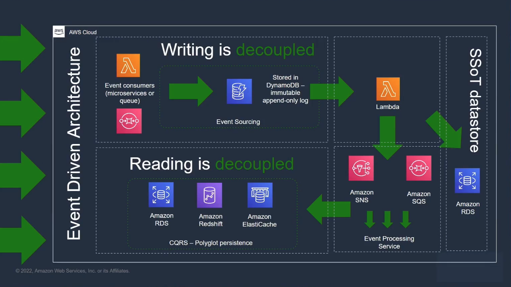

# As verdades sobre a migração de monolitos para microsserviços

## Introdução

    Sempre que falamos de migrar aplicações monolíticas para aplicações modernas utilizando microsserviços surgem diversas dúvidas sobre qual a melhor estratégia e quais padrões de projeto podem ser utilizados para se obter sucesso nesta jornada. Nesta talk vamos falar das principais técnicas de engenharia de software necessárias para fazer essa migração com sucesso!

---
Livro: 
Sam Newman - Molotith to Microservices

---
Implementação independente que funcionam em conjuntos. 
Se comunicam através de rede
Os bancos de dados estão ocultos dentro do limites do serviço.

Para funcionar bem é nessesário usar a feature toogle (estratégia de engenharia de software);

Baixo acoplamento:

    As equipes estão aclopadas? 
        -  Não adianta uma pessoa acabar seu trabalho e não poder lançar pq outra funcionalidade ainda não terminou.

    Sempre donos de seus própios dados.

Reunião Gmude.

    Fazer reuniões com as equipes para ver se uma alteração em um dos microserviços pode causar algum problema.

Modelar microserviços.

    Vantagens:
        - misturar e combinar tecnologias (cada equipe possui uma maior facilidade com certa tecnologia)
        - capacidade de escalabilidade independente
        - times menores e com foco bem definido
        - fluxos de trabalho, monitoramento, solução de problemas e testes E2E mais simples

    Problemas:
        - Vários serviços que precisam ser implantados (deployados) juntos, isso é monolito distribuído.
        - Uma organização que tem estrutura monolitica produz serviços monolitos (Lei de Conway).

Pq mudar?

    - melhorar a autonomia da equipe
    - Reduz tempo de lançamento (peças menores = mais rápido)
    - Eficiência de custo
    - Melhorar a resiliencia (arquitetura de charting?) evitar bancos de dados únicos.
    - Aumentar o número de desenvolvedores, não adianta possuir o mesmo banco de código (repositório de código). 100 devs olhando o msm git
 
O que pode causar dificuldades.

    - Domínio pouco claro (precisar ser bem pensado).
    - Startups -> começar com um monolito, pode ser complicado iniciar com microsserviçoes
    - Não ter um bom motivo, apenas pq todos estão usando?

Refazer tudo para o microserviços de uma vez pode ser problemático.

    if you do a big-bang rewrite, the only thing you are guaranteed of is a big-bang.

Design orientado a domínio.

    - Olhar pela parte que é menos "chamado/acoplado", que é menos utilizados por outros serviços ou que não depende de ninguém.
    - Acoplamento(quem chama ele). 
    - Começar pelas periferias.

Reorganizando as equipes.

    - Leve o time de front e back pro msm squad (msms goals), não vale a pena deixar separados.
    - Fazer uma avaliação técnicas das equipes, ver se a equipe tem as habilidades necessárias para essa migração. (se precisa capacitar)
 
Como saber se a migração está funcionando?

    - Encurtar os pontos de checagem, verificações regulares
    - Medidas quantitativas e qualitativas, sempre as duas juntas. Não migrar se o tempo de resposta for piorar, por exemplo. Métrica de ouro, sempre mais próxima do cliente. Ex: vendas/s (perto do cliente);
    - Falácias dos custos irrecuperáveis, sabendo que o projeto não vai dar certo continuar colocando dinheiro nele. Saber quando parar, se não está dando certo pare ou replaneje.

Design Pattern

    - Strangler fig pattern (estrangulando o monolito)

Começando a migrar

    - O novo microserviço se conecta o monolito com um ACL, unidirecional. Se for bidirecional precisa ser remodelado.
    - Quer começar a migrar, utilize a estratégia de feature flag/toogle.

CQRS - usar banco de dados de propósitos especificos

Começar considerando CQRS

Perguntas:

    - comunicação entre microserviços
        - Gosta de utilizar API Rest, mais simples de gerir e estudar, pode usar Socket (ver prós e contras).

    - Deploy separado do front e back, se possui o mesmo comportamento em termo de CI/CD. Um exemplo é um campo novo que precise de uma nova rota no back. precisam ir pra prod juntos.

    - Versionamento  de api. Criar uma versão intermediário 1.0 e 2.0, criar uma versão 1.5 que contém o conteúdo das duas versões juntas. (evita de quebrar de uma vez, da mais tempo para os times se organizarem)  