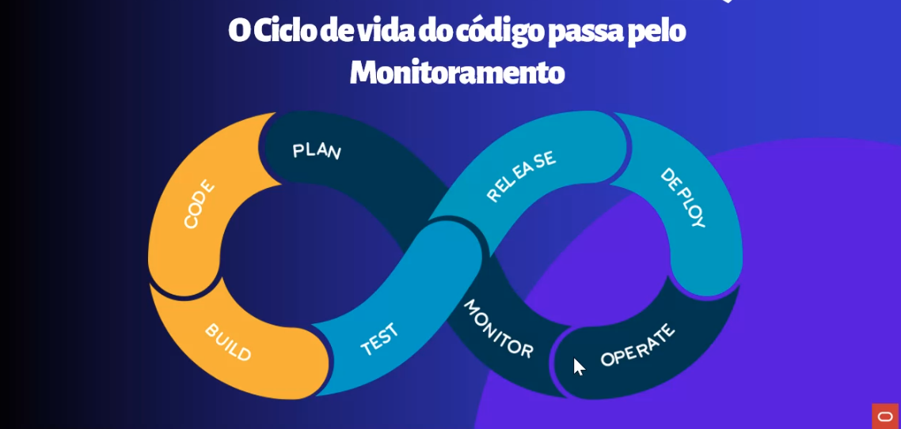
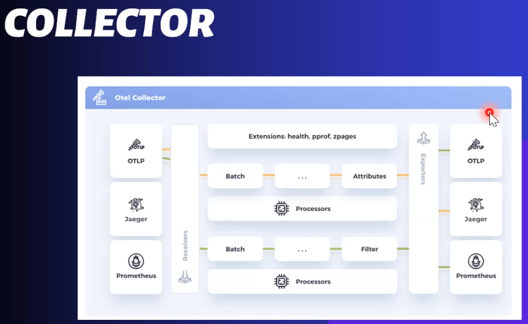

# O Serviço é Micro, Mas não é Invisível - A importância do OpenTelemetry no Monitoramento

## Introdução

Arquitetura de Microsserviços traz maior complexidade no monitoramento das aplicações. É preciso que o monitoramento faça parte do planejamento inicial da aplicação para se ter uma observabilidade que vá além da infraestrutura e dos logs.

A Palestra tem como objetivo apresentar como a utilização do SDK do OpenTelemetry na aplicação a torna apta para ser monitorada por ferramentas OpenSource e ferramentas proprietárias. Trazendo maior visibilidade assim como a opção de escolha da melhor estratégia de monitoramento para a aplicação.

---

## Monitoramento de microsserviços

- Monitoramento
- Documentação (importante documentar os projetos)
- Complexidade

telemetria (o que está acontecendo dentro do código, gargalos da aplicação, quanto tempo cada chamada demora).

O monitoramento precisa ser planejado junto com o código

   Telemetria é (geralmente) uma lib que vai entrar no código.
   Coleta automatizada de dados dos sistemas monitorados. Utilizados para avaliar performance e possíveis bugs. 

Desafios:
 - Instrumentação
 - Arquitetura
    - Muito distribuída (várias linguagens)
 - Lock-In
    - Quando a aplicação já está rodando e recorre a uma ferramenta de mercado.
    - Após um tempo começa a ficar caro.
    - Por isso precisa planenado junto com a criação do código.

Instrumentação
Qual agent será usado para observar o código, qual parte será observada.

## OpenTelemetry OpenTracing e OpenCensus
Tendência de mercado

- Signals - o que ele envia 
- Traces - tempo que demorou para executar um código
- Metrica - quanta cpu e memória
- Logs - Log de cada trace
- Baggage - Contextualizar a aplicação e enviar de um ponto a outro. Um para cada microsserviço, assim saberemos o tempo de cada um e descobrir possíveis gargalos.

Permite Instrumentação automática e manual.

Collector
Quem vai pegar a informação e enviar para onde vai ser analizada.

A partir do momento que envia para o collector é possível mudar para onde ele vai enviar os dados analisados (uma ferramenta nova por exemplo).

K8S Operator
Através de um manifesto ele monta um collector.

[Código Github](https://github.com/ChristoPedro/demo-telemetry-tdc)

Ele monitora as requisições de banco automáticamente.