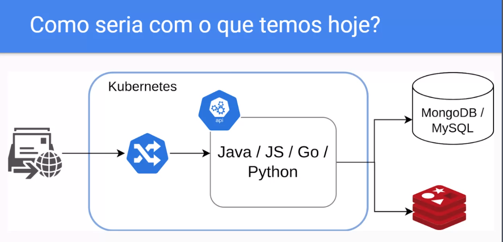

# Java + Quarkus + Native + ScyllaDB do zero até milhões de requests

## Introdução
    Desenhar e implementar sistemas nunca foi algo fácil, ainda mais quando vamos receber milhões de requisições por minuto. Aqui vamos mostrar uma solução simples: Java + Quarkus + native + scylladb + Kubernetes. Venha conhecer o que essa poderosa stack pode te ajudar e conhecer como atender milhões de requests com uma baixa latência.
---

Conceitos

Teorema CAP
- Consistência
    - Todos estão vendo a mesma coisa?
- Disponibilidade
    - Todo mundo consegue acessar?
- Particionamento
    - O sistema continua a funcionar?

### Sobre a informação, podemos retornar algo que não está atualizado?

    Uma questão importante é se a informação presica estar sempre atualizada.

    Em conversa com a área de negócio colocamos as cartas na mesa.
    - $$$ Retornar semprea a mesma coisa.
    - $ Retornar eventualmente um resultado diferente por um período curto.

    ScyllaDB
    - Escrito em C++
    - Api compativel com Cassandra e DynamoDB
    - Feito para Nuvem
    - Fácil operação
    - É possível conectar com drive do cassandra
    - Focado em disponibilidade e consistencia
    - Garantir que vai ter um retorno e rápido.

### ScyllaDB x MongoDB

    ScyllaDB
    - Chave e valor
    - Colunar (Tabelão)
    - Temporal

    MongoDB
    - Documento

### Qual linguagem?

    Quarkus + GraalVM
    - Possibilidade de usar JVM ou GraalVM (possuia casos em produção)
    - Facilidade para gerar métricas
    - Quarkus vem com várias praticidades
        - Client Http
        - Cache
        - Rest
        - Resiliência (Retry, Circuit Breaker, Bulkhead, etc...)
        - Injeção de dependência
    - Com JVM o 'startup time' consome muita CPU, no caso do GraalVM é extremamente rápido
    - Com GraalVM é possível ter PODs mais 'enxutos'
