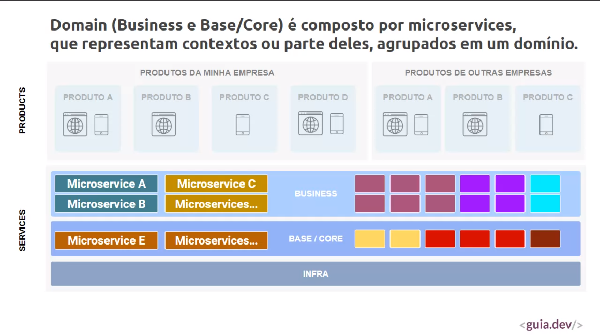

# Compondo uma plataforma de software com microservices.

## Introdução
    Atualmente fala-se muito em soluções de software em uma visão de plataforma! Contudo uma plataforma contempla muitos aspectos que vão além da simples utilização do termo ou ainda apenas escolher uma arquitetura como microservices. Plataforma inclui coisas como: visão de DDD, arquiteturas distribuídas e orientadas a eventos, BFF (backend for frontend), DOMA , API Gateways/Manager, modelagem e distribuição dos dados, visão de camadas de produto, serviços e core, APIs, dependências, integrações, organização de times, etc. Na apresentação será abordado como cada tema deste se relaciona e formas de organizar e representar estes conceitos a fim de compor de fato uma plataforma de software.
---

### Evolução do software até o modelo de plataforma

    Modelo SaaS (Software as a service)

Quando se fala de plataforma

    Construir uma base de funcionalidades reutilizáveis que facilite a criação de novas features de forma rápida através do reuso da base existente.

Uma plataforma começa a existir quando ha vários produstos e serviços integrados entre eles. Reaproveitando um conjunto comum de serviços (softwares).

Uma plataforma possui 2 divisões (produtos e serviços)
    - uma estruturas de camadas

Produtos

    - produtos oferecidos pela própria empresa
    - produtos de outras empresas

Serviços

    - Business (dominíos)
    - Base/Core (serviços mais genéricos)
    - Infra

### Microsserviços
    Domain (Business e Base/Core) é composto por microsserviços que representam contextos ou partes deles, agrupados em um domínio.

### Apis

    - O foco não pode ser "endpoints para o front".
    - Deve haver um padrão e consistência nos contratos.
    - Deve ser documentada (essencial para que tenham produtos olhando para sua camada de serviços).
    - Sempre expostas a partir de um Gateway/Manager.

### Arquitetura Orientada a Eventos

    - Deve-se evitar a comunicação direta entre microserivos
    - microservices publicam e consomem eventos
    - tais eventos devem ser os eventos de dominio
    - contratos das mensagens devem seguir o modelo de dominio.
        - pensar que são eventos da plataforma como um todo.
    - um evento publicado não deve conhecer diretamente seus consumidores
    - Utilizar um webhook para comunicar os produtos com o barramento de eventos da camada de serviços.

### Dados

    - Cada microservico possui sua propria base.
    - Os dados podem ser replicados em um local centralizados (CQRS, DataLake, ...).
    - Modelagem dos dados respeita o modelo de domínio.
    - Dados podem ser replicados/populados a partir dos eventos.
    - Camada de produtos e mircrosserviços podem consultar os dados através de Graphql ou outras estratégias dinâmicas de consulta.

### Integração com terceiros

    - Deve-se evitar que muitos microservices se integrem diretamente a um mesmo terceiro.
    - Centralize a integracao em um ùnico microserviço e os outros se comunicam com este.

### Gerenciamento e orquestração de microservices

    Uma plataforma deve ter definições e mecanismos padrões para:
    - Conteinerização
    - Monitoramento
    - Descoberta de serviços
    - Resiliência, tolerância a falha e auto escala
    - Todo ferramental de gerenciamento e orquestração aparece na camada de infra

### Camada de produto, mais que apenas frontend

    - Microsserviços não devem conter lógicas relacionadas ao frontend. Para isso pode-se utilizar BFFs (Backend for frontend).
    - BFFs podem ser utilizados para lógicas em backend, sem contaminar os microsserviços.

### Pocs/Mvps

    Mvps ou Pocs nascem na camada de produto e quando consolidados geram serviços na camada de serviços.

### Organização de times

    - A organização de times é feita considerando a modelagem de dominios e as camadas da plataforma
    - Times focados em um contexto ou serviços específicos.
    = Importante ter um arquiteto que consiga fazer a gestão e pensar em como fara a conexão entre os  níves da camada de serviços e também entre a a camada de serviço e produto. 

### Representar visualmente a plataforma

    - Diagrama usando C4Model
    - O diagrama é utilizado para planejar e depois implementar

