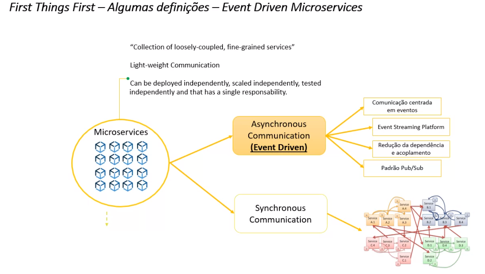
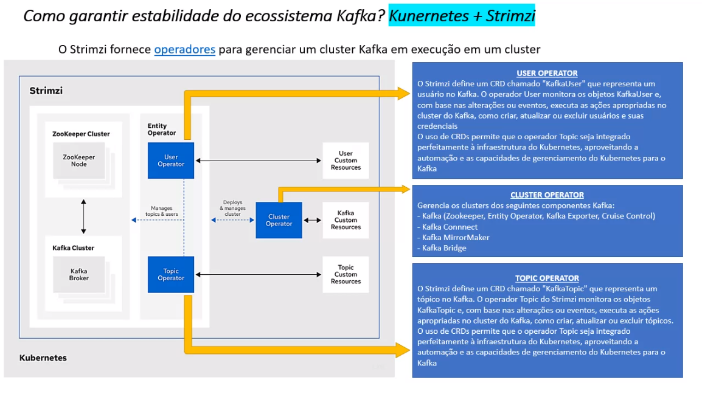
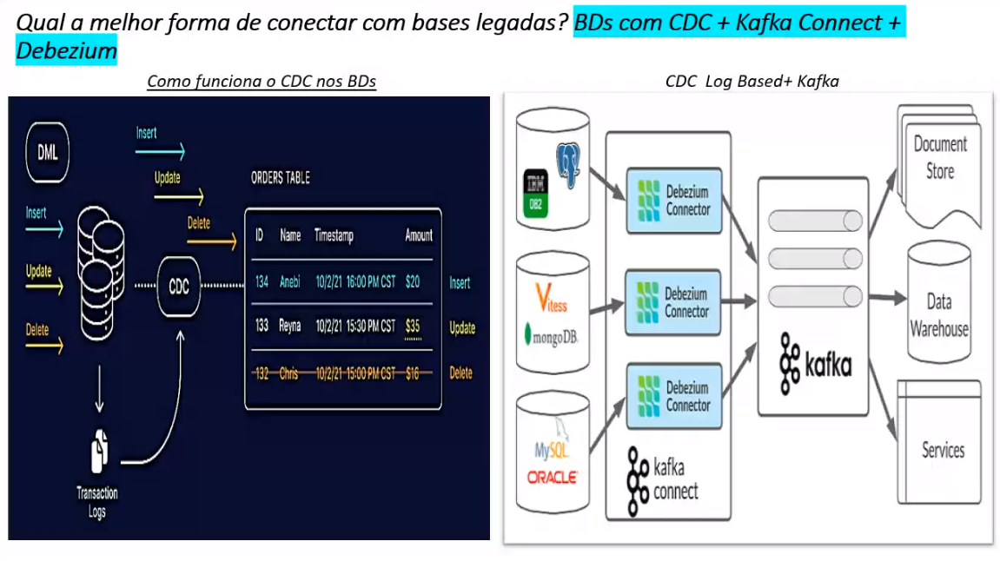

# Habilitando Micro Serviços Baseados em Event Streaming com Kafka, Kubernetes, Debezium e CDC

## Introdução
    A ideia dessa apresentação é compartilhar vivências, erros, acertos, problemas e soluções encontrados no processo de definição arquitetural, implantação de infraestrutura em Cloud, implementação de sistemas orientados a eventos utilizando a Kafka de forma conteinerizada, dentro de Kubernetes.
---

## Tipos de comunicação entre microsServiços

    Quando possui muitos microserviços pode ser um problema utilizar comunicação sync.

## Event streaming

    Kafka veio para garantir escalabilidade.

### Como garantir a estabilidade do ecossistema Kafka?

    Kubernetes Strimzi Operator
    - Alta disponibilidade
    - Fácil gerenciamento
    - Escalabilidade horizontal 
    - Redução de tempo de implantação

### Qual a melhor forma de conectar com bases legadas?

    Change Data Capture Debezium
    - CDC possibilita detectar as alterações nos dados sem precisar utilizar as tabelas transacionais
    - Debezium é um componente escalável especializado na leitura e tratamento de dados de CDC de boa parte dos BDs de mercado

    Change Data Capture (CDC) 
    - CDC é uma técnica usada em bancos de dados para capturar e registrar em tempo real as mudanças feitas nos dados. 
    - Ele monitora as transações e registra as alterações, como inserções, atualizações e exclusões de registros, em um log de transações. 
    - O CDC permite o acesso imediato às mudanças, facilitando a integração de sistemas e a geração de relatórios em tempo real.

### Como garantir a eficiência na escalabilidade dos consumidores?
    Consumidores Customs no K8S
    - Consumidores "próximos" ao cluster Kafka com garantia de escalabilidade horizontal

## Strimzi

## CDC (Change data capture)

