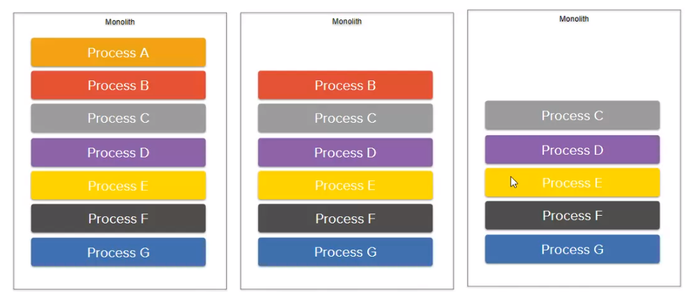
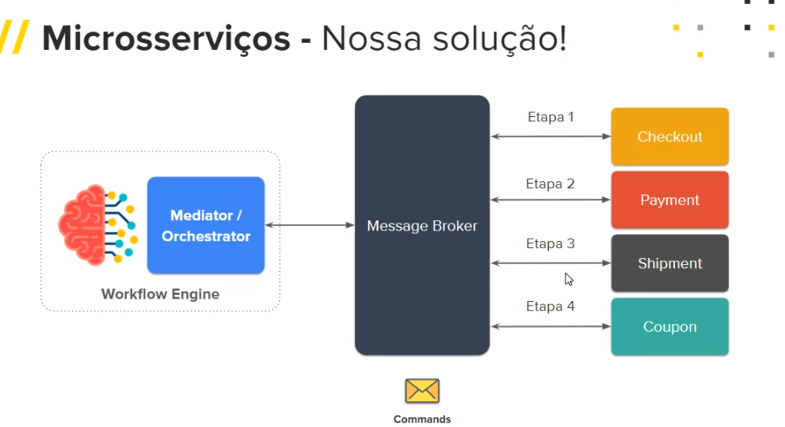

# Event-Driven Microservices Architecture: Até que ponto é sustentável?

## Instrução
    Ao longo dos anos a arquitetura distribuída vem sendo amplamente adotada, por prover inúmeras vantagens como: manutenção, heterogeneidade tecnológica, escalabilidade, desacoplamento, etc.

    Nesse sentido, a arquitetura orientada a eventos vem sendo amplamente adotada devido suas inúmeras vantagens, como o baixo acoplado, porém conforme sua arquitetura vai evoluindo em conjunto com os novos casos de uso, vai alimentando uma dor nessa arquitetura exponencialmente.

    Nesta palestra, iremos abordar como lidamos com essa dor latente de adicionar novos fluxos de processos e suas possíveis soluções mesclando estilos arquiteturais.

---

### Strangler Pattern

    O Strangler Pattern é uma abordagem para modernizar sistemas legados gradualmente, substituindo partes específicas por componentes mais novos. Funcionalidades são encapsuladas em novos serviços, roteando os dados entre os componentes legados e os novos. O sistema antigo é substituído gradualmente até ser totalmente atualizado.

## Event Drive Architecture (Broke Topology)

    - Forma de se comunicar é via evento (async)
    - O acoplamento é baixíssimo.

    Dores:
    - Se ouver muitos microservices que reagem a um evento, caso hajam muitos fluxos diferentes pode causar um problema, pois alguns desses começariam a descartar eventos.
    - Caso o evento a ser ouvido mude.
    - Gerenciar o workflow acaba ficando muito complexo caso haja muitos microserviços com diversos fluxos.

    Como sanar essas dores?
    - Mediator Topology

## Mediator Tolopolgy

    Mediator Topology é útil para eventos que possuem várias etapas e requerem algum nível de orquestração para processar o evento.

    Todas essas etapas exigem algum nível de orquestração para determinar a ordem das etapas e quais podem ser executadas em série e em paralelo.

### Como garantir que o mediator não fique muito grande?

    - Governância, apenas algumas pessoas tem acesso a ele (Fica na camada de Core).

