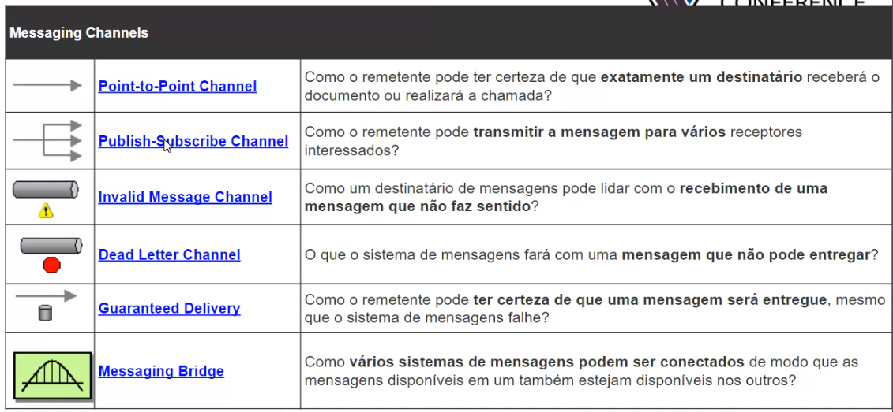
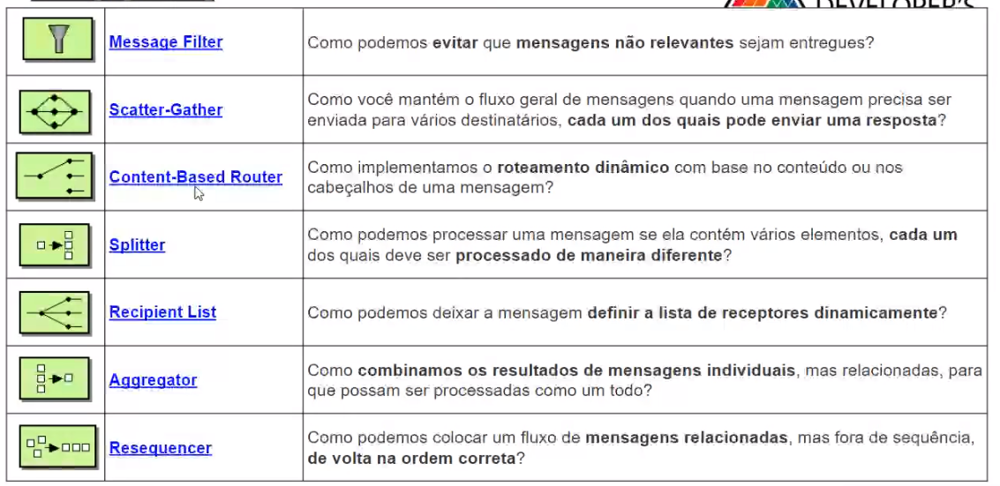
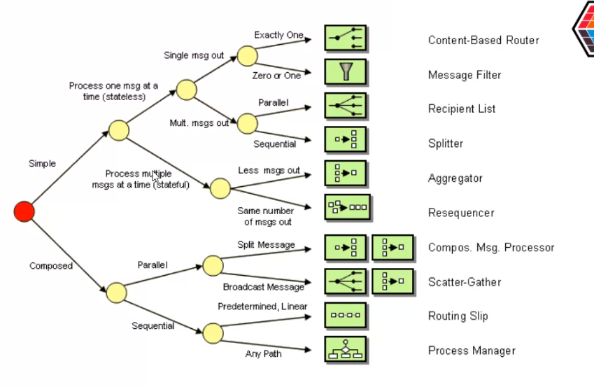
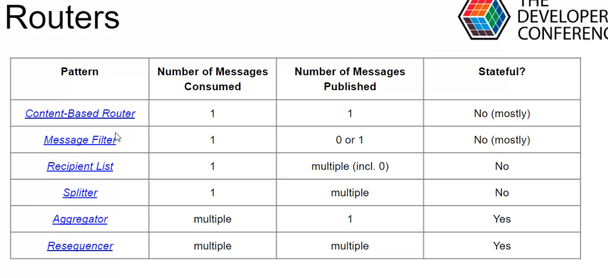
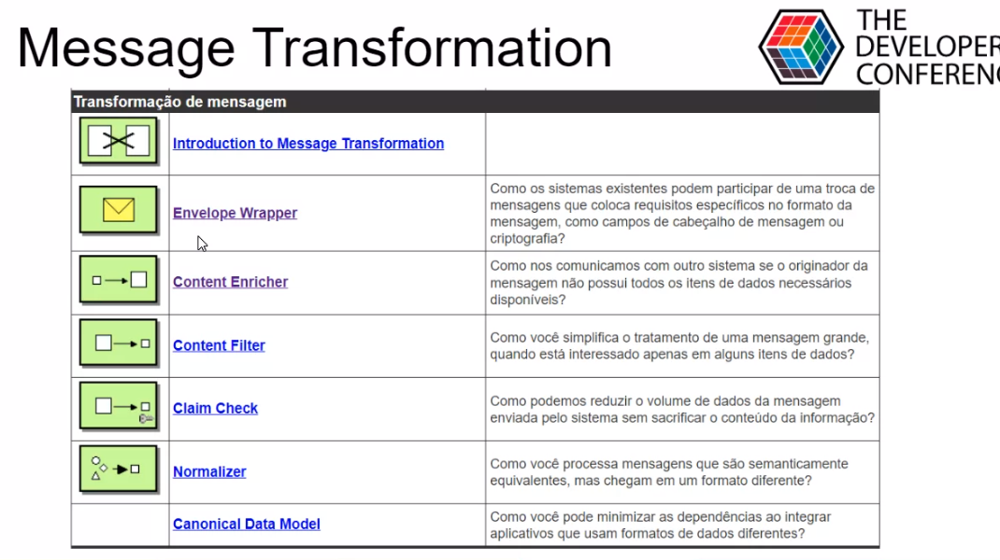
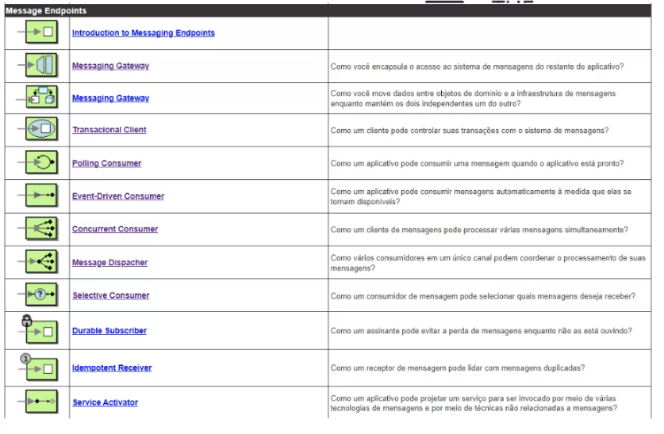
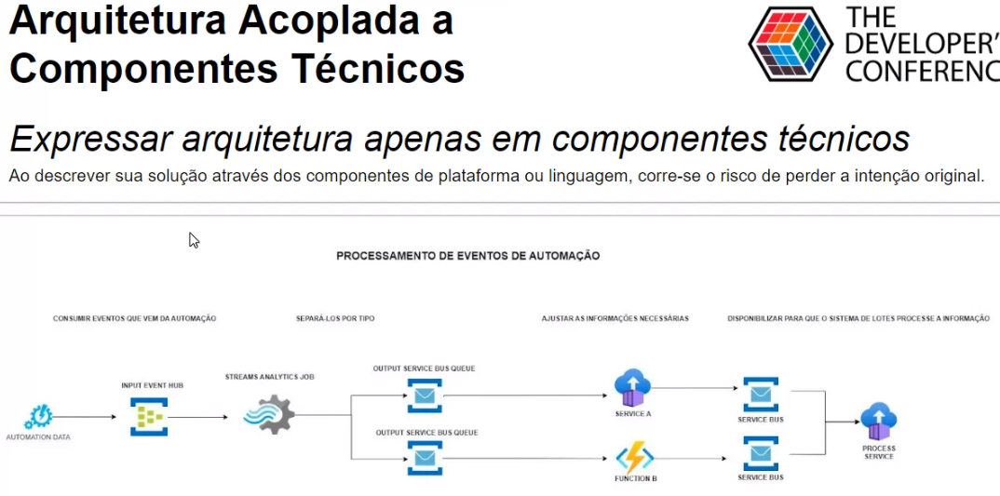
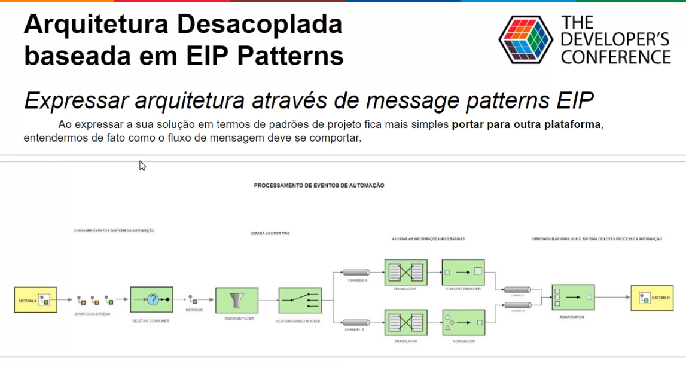

# Message patterns: padrões de comunicação assíncrona em microsserviços e qual problema resolvem

## Introdução
A natureza distribuída da arquitetura de microsserviços requer uma infraestrutura de mensagens que conecte os componentes idealmente de maneira fracamente acoplada para maximizar a escalabilidade. As mensagens assíncronas são amplamente utilizadas e oferecem muitos benefícios, mas também trazem desafios como ordenação de mensagens, gerenciamento de mensagens suspeitas, idempotência e muito mais, nesta palestra vamos conhecer os principais message patterns e que problema endereçam.

---

Motivação
- Microserviços trazem um aumento exponencial da necessidade de comunicação async por sua natureza distribuída e independente.

## Message Systems
| Nome message systems | Qual pergunta responde |
| --- | --- |
| Message Channel| Como um aplicativo se comunica com outro usando mensagens? |
| Message | Como duas aplicações conectadas por um canal de mensagens podem trocar uma informação? |
| Pipes and Filter | Como podemos dividir um processamento complexo em tarefas menores mantendo independência e flexibilidade? |
| Message Router | Como você pode desaclopar as etapas de processamento individuais para que as mensagens possam ser passadas para diferentes filtros, dependendo de um conjunto de condições? |
| Message Translator | Como os sistemas que usam diferentes formatos de dados podem se comunicar uns com os outros usando mensagens? |
| Message Endpoint| Como um aplicativo se conecta a um canal de mensagens para enviar e receber mensagens? |

---

## Messagem Construction
| Nome messagem construction | Qual pergunta responde |
| --- | --- |
| Command Message| Como as mensagens podem ser usadas para **invocar um procedimento** em outro aplicativo? |
| Document Message | Como as mensagens podem ser usadas para **transferir dados** entre aplicativos? |
| Event Message | Como as mensagens podem ser usadas para **transmitir eventos** de um aplicativo para outro? |
| Request-Reply | Quando um aplicativo envia uma mensagem, como ela pode **obter uma resposta do remetente**? |
| Correlation Identifier | Como um solicitante que recebeu uma resposta sabe **para qual solicitação essa resposta é**? |
| Message Sequence | Como as mensagens podem **transmitir uma quantitade arbitrariamente grande** de dados ou **fazer parte de um grupo** de mensagens? |

---

## Messaging Channels

## Messaging Routing

## Como fazer as escolhas

## Message Transformation

## Message Endpoints

## Arquitetura acoplada a compontents técnicos.

## Arquitetura desacoplada baseada em EIP. (Enterprise Integration Pattern)

Não está acoplada a tecnologia, o fluxo segue de modo universal.

